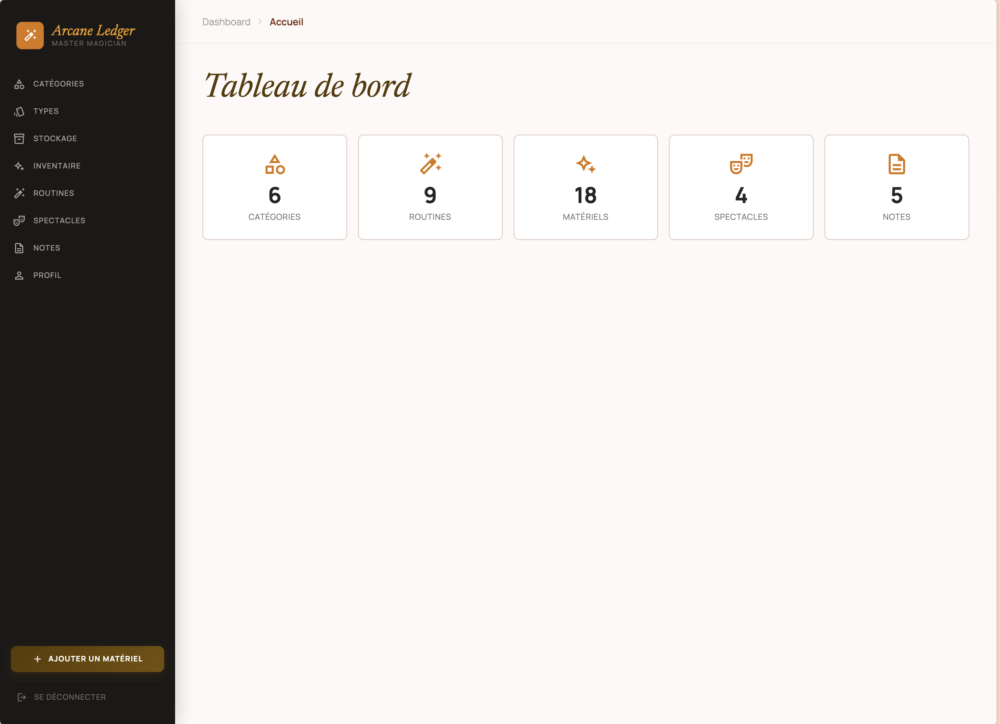
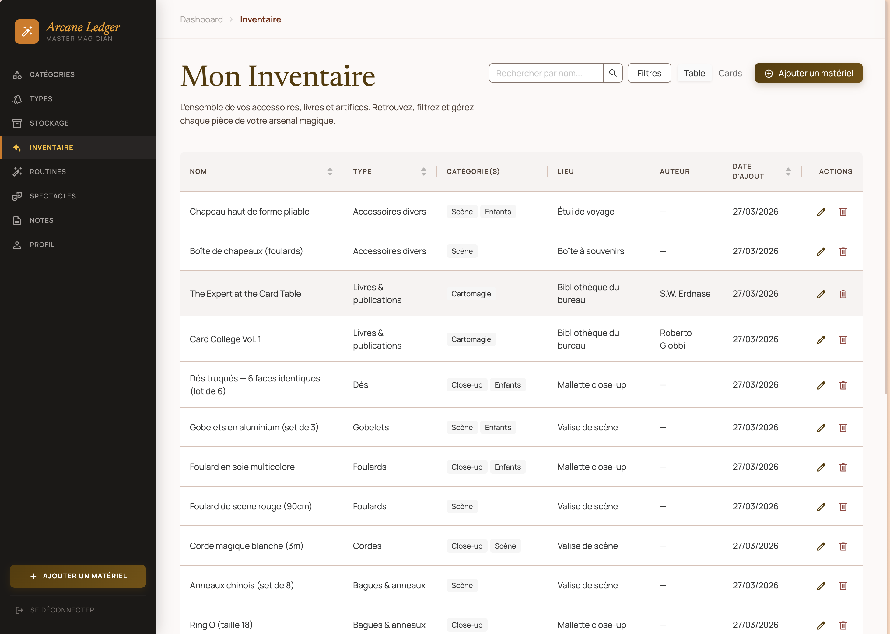
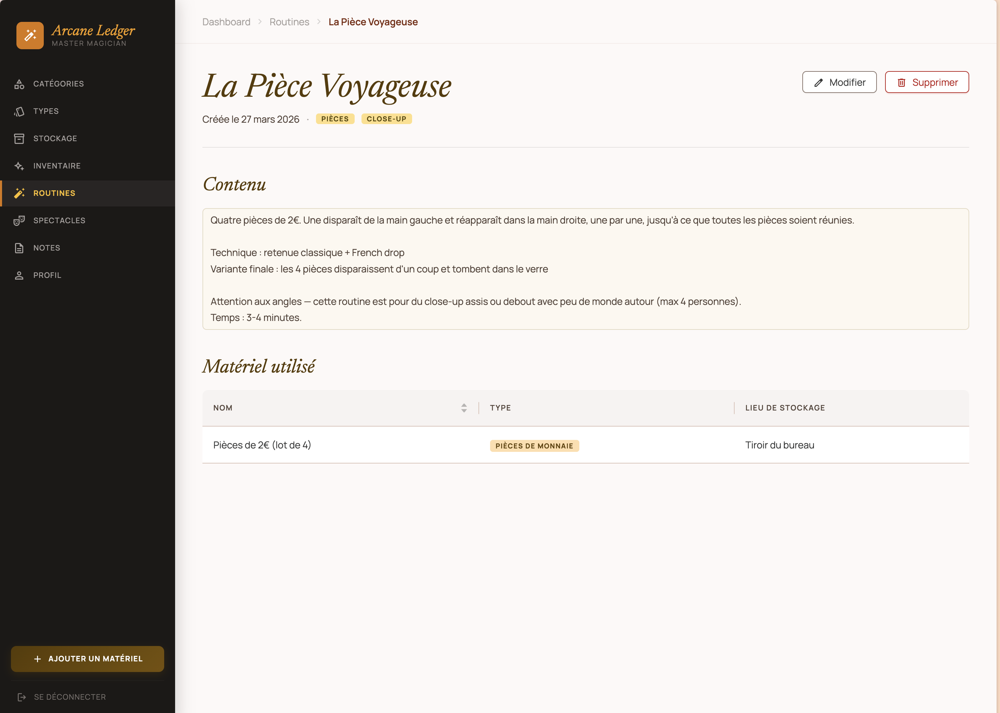
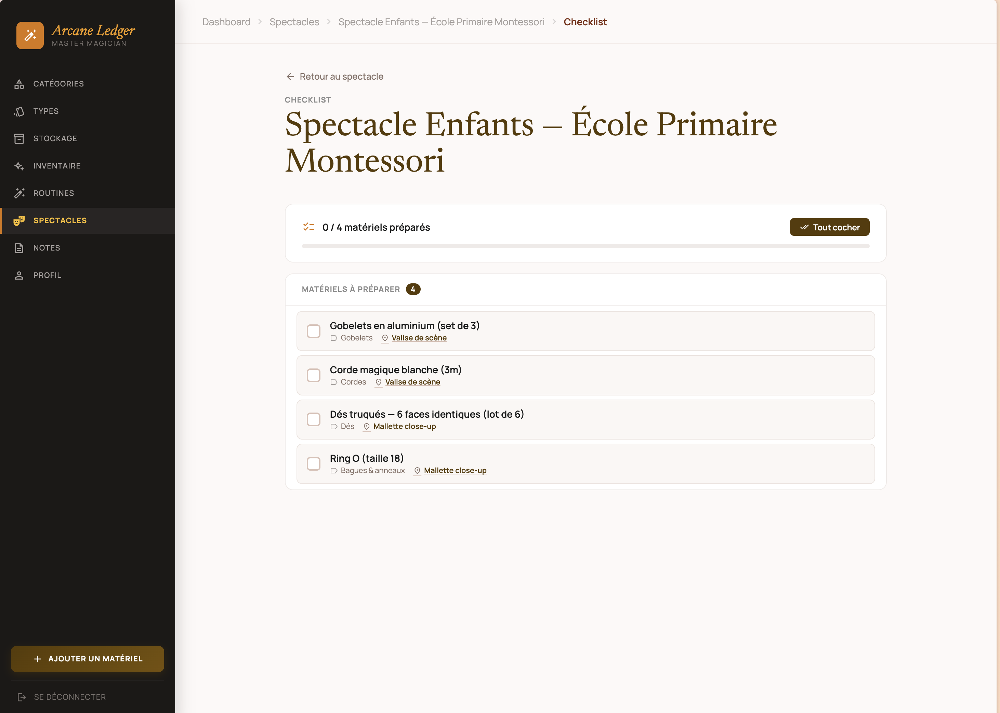

<div align="center">

# ✦ Arcane Ledger

### L'inventaire pensé pour les magiciens professionnels

*Vos accessoires, routines et spectacles — tout sous contrôle.*

<br/>

[](https://adonisjs.com)
[](https://react.dev)
[](https://inertiajs.com)
[](https://typescriptlang.org)
[](https://postgresql.org)

<br/>



</div>

---

## Pourquoi Arcane Ledger ?

Avant chaque représentation, la même question : *est-ce que j'ai tout ?* Une baguette oubliée, un accessoire laissé dans la mauvaise valise, une routine mal préparée — et le show est compromis.

**Arcane Ledger** centralise l'intégralité de votre arsenal magique. Du foulard de soie au grand illusion, de l'acte signature au gala annuel : tout est catalogué, organisé, et prêt à être coché avant de monter sur scène.

---

## Fonctionnalités

### Matériels

Cataloguez chaque accessoire avec ses informations essentielles : catégorie, type, emplacement de rangement. Des tags colorés permettent une identification instantanée. Retrouvez n'importe quel prop en quelques secondes.



---

### Routines

Composez vos tours et numéros en associant les accessoires requis. Réorganisez les étapes par glisser-déposer. Votre routine d'apparition de colombes ? Tous les props nécessaires sont listés, dans le bon ordre.



---

### Spectacles & Checklist

Assemblez vos routines en spectacle complet. Le soir J, activez la **checklist interactive** : cochez chaque accessoire au fur et à mesure que vous remplissez vos valises. Montez sur scène avec une certitude absolue.



---

## Ce que vous gérez

| Module | Description |
|--------|-------------|
| **Matériels** | Props, accessoires, décors — catalogués avec catégorie, type et lieu de rangement |
| **Routines** | Tours et numéros avec la liste des accessoires requis, réordonnables |
| **Spectacles** | Programmes complets assemblés depuis vos routines |
| **Checklist** | Vérification accessoire par accessoire avant de partir en représentation |
| **Notes** | Observations de répétitions, idées d'amélioration, retours de spectacles |
| **Catégories & Types** | Classification personnalisée adaptée à votre pratique |
| **Emplacements** | Où chaque accessoire est rangé (valise, malle, sac...) |
| **Export / Import** | Sauvegarde complète de vos données en JSON |

---

## Stack technique

| Couche | Technologie |
|--------|-------------|
| **Backend** | [AdonisJS v6](https://adonisjs.com) (Node.js, TypeScript) |
| **Frontend** | [React 19](https://react.dev) + [Inertia.js v2](https://inertiajs.com) |
| **UI** | [Ant Design v6](https://ant.design) |
| **Base de données** | PostgreSQL + [Lucid ORM](https://lucid.adonisjs.com) |
| **Validation** | [VineJS](https://vinejs.dev) |
| **Drag & Drop** | [@dnd-kit](https://dndkit.com) |
| **Tests** | [Vitest](https://vitest.dev) + Testing Library |
| **Build** | Vite |

---

## Installation

### Prérequis

- Node.js 20+
- PostgreSQL 14+

### Mise en route

```bash
# Cloner le dépôt
git clone <repo-url>
cd magic-inventory

# Installer les dépendances
npm install

# Configurer l'environnement
cp .env.example .env
# Renseigner les variables DATABASE_URL, APP_KEY, etc.

# Créer la base de données et lancer les migrations
node ace migration:run

# Lancer en développement
npm run dev
```

L'application est accessible sur [http://localhost:3333](http://localhost:3333).

### Variables d'environnement essentielles

```env
TZ=UTC
PORT=3333
HOST=localhost
LOG_LEVEL=info
APP_KEY=               # Générer avec: node ace generate:key
NODE_ENV=development

DB_HOST=localhost
DB_PORT=5432
DB_USER=postgres
DB_PASSWORD=
DB_DATABASE=magic_inventory
```

---

## Scripts disponibles

```bash
npm run dev          # Serveur de développement (hot reload)
npm run build        # Build de production
npm start            # Démarrer en production
npm test             # Lancer les tests
node ace migration:run          # Appliquer les migrations
node ace migration:rollback     # Annuler la dernière migration
```

---

## Structure du projet

```
magic-inventory/
├── app/
│   ├── controllers/     # Contrôleurs AdonisJS
│   ├── models/          # Modèles Lucid (User, Material, Routine, Show...)
│   ├── middleware/       # Middlewares d'authentification
│   └── validators/      # Schémas de validation VineJS
├── database/
│   └── migrations/      # Migrations de base de données
├── inertia/
│   ├── components/      # Composants React partagés
│   ├── pages/           # Pages (Materials, Routines, Shows, Notes...)
│   └── css/             # Styles globaux
├── public/              # Assets statiques
├── start/
│   └── routes.ts        # Définition des routes
└── tests/               # Tests unitaires et d'intégration
```

---

<div align="center">

*Conçu pour les artistes qui refusent de laisser la logistique ruiner la magie.*

**✦**

</div>
